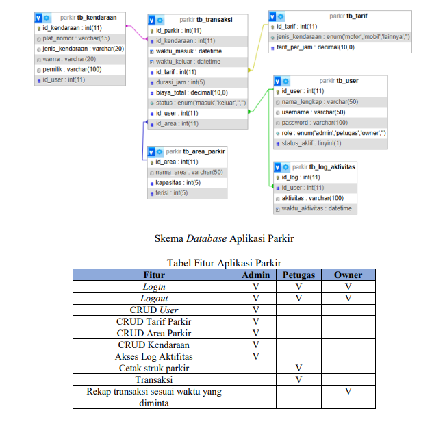

IV. SOAL/TUGAS
Judul Tugas : Pengembangan Aplikasi Parkir
Sebagai seorang Program Pemula (Novice Programmer) pada sebuah Perusahaan Software
Developer, anda ditugaskan sebagai programmer, anda diminta untuk membuat sebuah
Aplikasi Parkir.
Tugas Anda adalah membuat sebuah aplikasi parkir dengan 3 level pengguna dengan ketentuan
sebagai berikut:

Langkah Kerja:
1.  Siapkan lingkungan kerja dengan mempersiapkan komputer yang akan di-install
2.  Lakukan instalasi sistem operasi
3.  Lakukan instalasi software aplikasi yang akan digunakan
4.  Pastikan sistem operasi dan software aplikasi berjakan dengan baik
5.  Buatlah struktur data dan akses terhadap struktur data termasuk dengan tipe data dan
    control program untuk aplikasi
6.  Gunakan metode Waterfall sederhana atau prototype:
    a. Analisis Kebutuhan
    b. Desain (ERD dan diagram program)
    c. Implementasi kode
    d. Pengujian
    e. Dokumentasi
7. Buatlah deskripsi dan diagram alur (flowchart) atau pseudocode untuk minimal:
    a. Proses login
    b. Proses transaksi
    c. Cetak struk
8.  Buat dokumentasi terpisah untuk setiap modul (tuliskan input, proses dan output) untuk
    setiap proses beserta fungsi, prosedur dan method.
9.  Dengan menggunakan ERD yang dibuat dari poin 2 silakan mulai membuat database
10. Buat Folder projek, jalankan semua aplikasi yang programmer perlukan
11. Buatlah aplikasi dengan memperhatikan Coding Guidelines dan Best Practices.
    Perhatikan:
    a. Pastikan halaman memuat dengan cepat (gunakan query yang efisien)
    b. Gunakan prosedur dan fungsi
    c. Gunakan array
    d. Hindari looping yang tidak perlu
    e. Gunakan limit ketika menggunakan data besar
12. Lakukan debugging ketika menemukan error dan perbaiki
13. Buat Laporan Singkat :
    a. Fitur yang sudah berjalan dengan baik
    b. Bug yang belum diperbaiki
    c. Rencana Pengembangan berikutnya

Hasil yang diharapkan dari rangkaian kerja di atas adalah terbuatnya Aplikasi Parkir sesuai
dengan ketentuan fitur, dibuktikan dengan pengumpulan :
1. Folder Proyek Aplikasi (kode program lengkap)
2. Database dengan ekstensi .sql
3. Dokumentasi :
    a. ERD
    b. Deskripsi Program
    c. Dokumentasi fungsi/ prosedur
    d. Debuging
4. Laporan evaluasi singkat